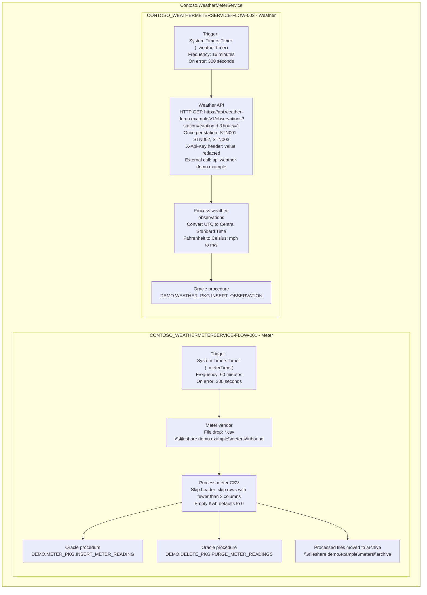

```mermaid
flowchart TD
    subgraph SERVICE["Contoso.WeatherMeterService"]
        subgraph METER["CONTOSO_WEATHERMETERSERVICE-FLOW-001 - Meter"]
            MT["Trigger: System.Timers.Timer (_meterTimer)<br/>Frequency: 60 minutes<br/>On error: 300 seconds"]
            MS["Meter vendor<br/>File drop: *.csv<br/>\\\\fileshare.demo.example\\meters\\inbound"]
            MP["Process meter CSV<br/>Skip header; skip rows with fewer than 3 columns<br/>Empty Kwh defaults to 0"]
            MI["Oracle procedure<br/>DEMO.METER_PKG.INSERT_METER_READING"]
            MD["Oracle procedure<br/>DEMO.DELETE_PKG.PURGE_METER_READINGS"]
            MA["Processed files moved to archive<br/>\\\\fileshare.demo.example\\meters\\archive"]

            MT --> MS --> MP
            MP --> MI
            MP --> MD
            MP --> MA
        end

        subgraph WEATHER["CONTOSO_WEATHERMETERSERVICE-FLOW-002 - Weather"]
            WT["Trigger: System.Timers.Timer (_weatherTimer)<br/>Frequency: 15 minutes<br/>On error: 300 seconds"]
            WS["Weather API<br/>HTTP GET: https://api.weather-demo.example/v1/observations?station={stationId}&amp;hours=1<br/>Once per station: STN001, STN002, STN003<br/>X-Api-Key header; value redacted<br/>External call: api.weather-demo.example"]
            WP["Process weather observations<br/>Convert UTC to Central Standard Time<br/>Fahrenheit to Celsius; mph to m/s"]
            WI["Oracle procedure<br/>DEMO.WEATHER_PKG.INSERT_OBSERVATION"]

            WT --> WS --> WP --> WI
        end
    end
```
